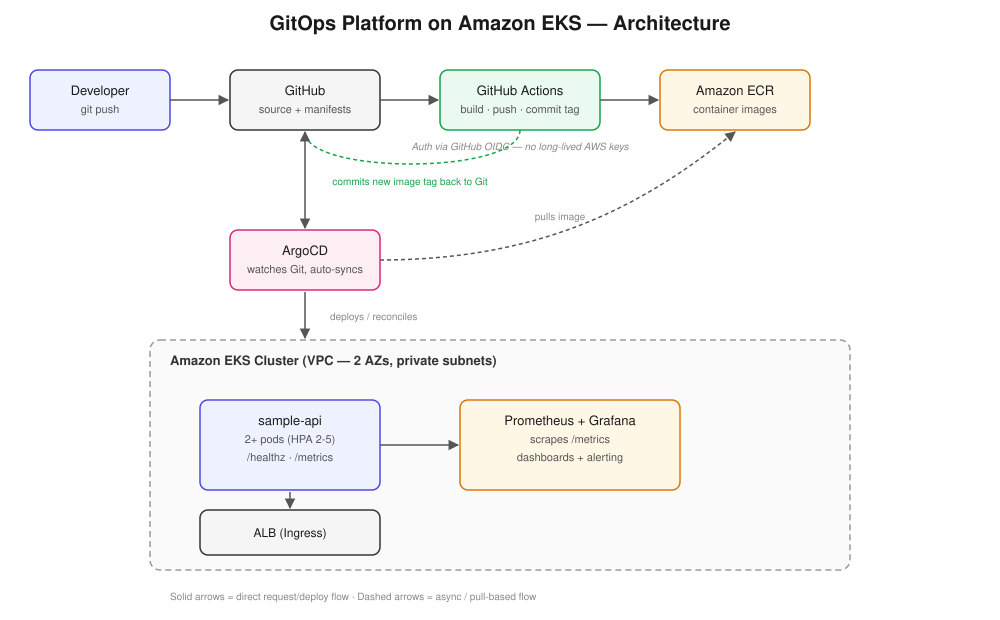

# GitOps Platform on Amazon EKS

A self-contained cloud platform demonstrating an end-to-end GitOps workflow:
Terraform-provisioned infrastructure, ArgoCD-managed deployments, CI-driven
image builds, and a full observability stack — built to mirror how a small
platform/SRE team actually runs production infrastructure.

> Built as a portfolio project to demonstrate infrastructure-as-code, GitOps,
> and observability practices referenced on my resume. Not a production
> system — see "Known Limitations" below for what I'd change before calling
> it production-ready.

## Architecture



## What this demonstrates

- **Infrastructure as Code** — full VPC + EKS cluster provisioned via Terraform, using versioned community modules rather than hand-rolled resources
- **GitOps deployment** — ArgoCD continuously reconciles cluster state to match Git; no manual `kubectl apply` for application changes
- **CI/CD** — GitHub Actions builds and pushes container images via OIDC (no long-lived AWS credentials in CI), then commits the new image tag back to Git, handing off to ArgoCD
- **Observability** — Prometheus scrapes application and cluster metrics, Grafana visualizes them, Alertmanager is wired for alerting
- **Cost-conscious design choices** — single NAT gateway, short metrics retention, right-sized node instance types — all called out explicitly rather than hidden

## Repository structure

```
terraform/          VPC + EKS cluster infrastructure
argocd/              ArgoCD install notes + Application manifest
apps/sample-api/     Sample Flask app: Dockerfile, source, k8s manifests
monitoring/          Prometheus/Grafana Helm values
docs/                Architecture diagram, AWS OIDC setup guide
.github/workflows/   CI pipeline
```

## How to run this

**Prerequisites:** AWS account, Terraform >= 1.6, kubectl, Helm, AWS CLI v2, an ECR repo, and an IAM role configured for GitHub Actions OIDC (see `docs/aws-oidc-setup.md`).

```bash
# 1. Provision infrastructure
cd terraform
cp terraform.tfvars.example terraform.tfvars   # edit if needed
terraform init
terraform apply

# 2. Configure kubectl
aws eks update-kubeconfig --region eu-central-1 --name gitops-portfolio-cluster

# 3. Install ArgoCD — see argocd/install/README.md

# 4. Register the sample app with ArgoCD
kubectl apply -f argocd/apps/sample-app-application.yaml

# 5. Install monitoring stack
kubectl create namespace monitoring
kubectl create secret generic grafana-admin-credentials \
  --namespace monitoring \
  --from-literal=admin-user=admin \
  --from-literal=admin-password="$(openssl rand -base64 20)"
helm repo add prometheus-community https://prometheus-community.github.io/helm-charts
helm install monitoring prometheus-community/kube-prometheus-stack \
  -n monitoring -f monitoring/prometheus-values.yaml

# 6. Tear down when done demoing (EKS + NAT gateways cost money by the hour)
cd terraform && terraform destroy
```

## Results

- Manual deployment steps reduced via GitOps automation
- End-to-end deployment time (git push → pod running): 3-4 mins

## Known limitations / what I'd change for production

- Terraform state is local; production use needs an S3 backend + state locking
- No mTLS/service mesh between services
- Alertmanager has no real receiver configured (Slack/PagerDuty) — trivial to add, left as a TODO
- Single NAT gateway is a single point of failure — fine for a demo, wrong for production multi-AZ resilience
- No automated tests for the sample app itself — this project is about the platform, not app-level testing
- The CI→Git→ArgoCD commit-back pattern works but mixes app-repo and config-repo concerns; a cleaner setup would split these into separate repos so CI never pushes back into the repo I'm actively developing in

## Why I built this

Built to put hands-on proof behind infrastructure-as-code, GitOps, and
observability experience referenced on my resume, and to work through the
same Terraform → EKS → ArgoCD → CI pipeline pattern used by real platform
teams end-to-end.
